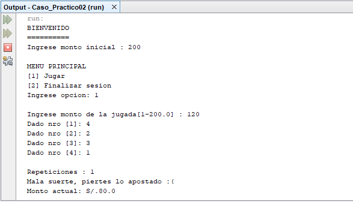

# Juego de Dados
Juego de azar con dados, donde ingresar con un monto inicial y según la repeticiones de los datos gana o pierde, al finalizar el juego arroja un reporte del juego, **08/11/19**.

<strong>Imagen:</strong> Menú principal - Juegar.

